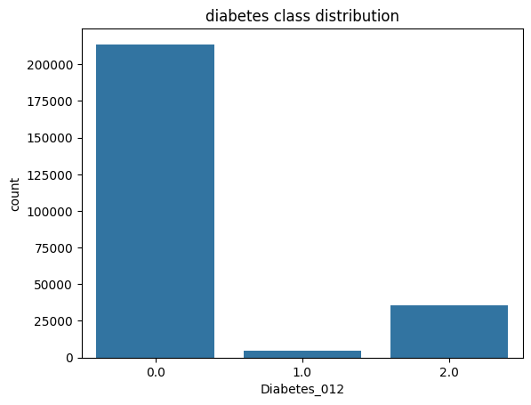
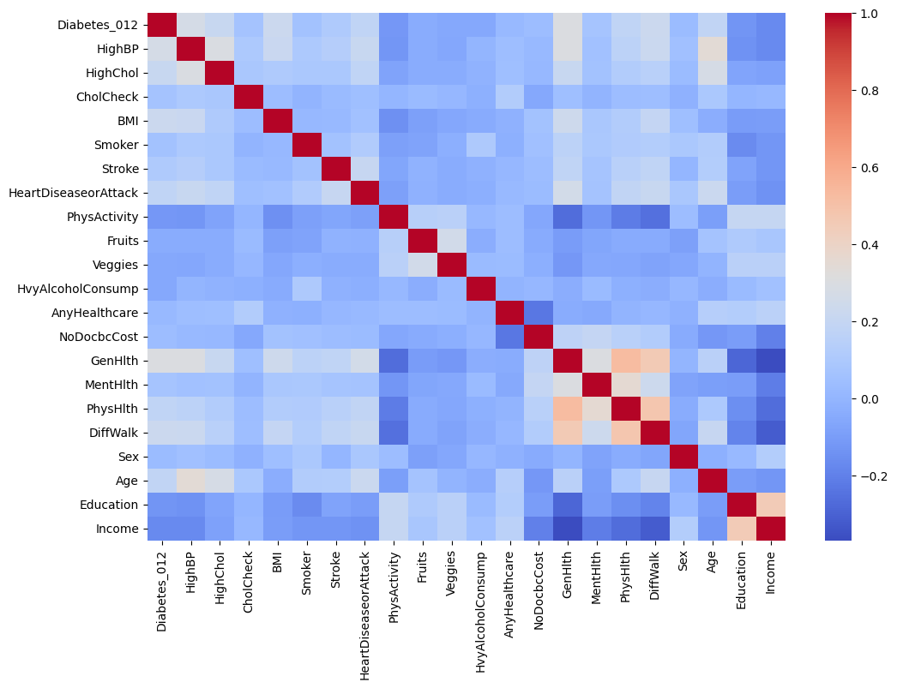
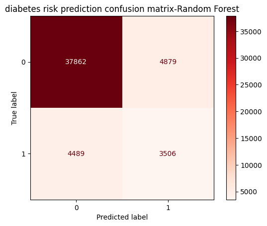
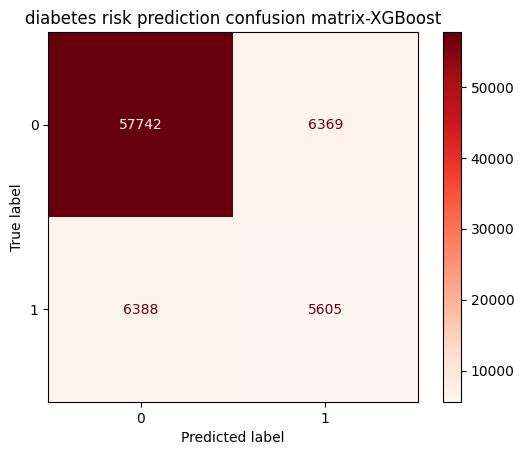
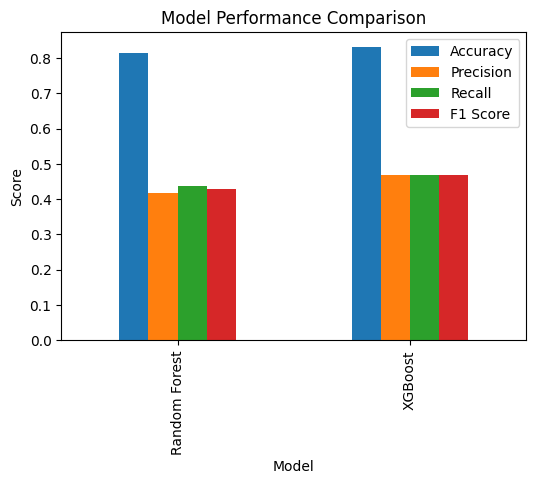
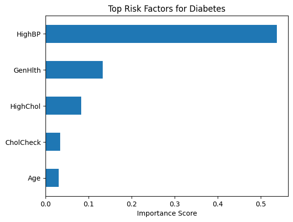

# Disease Risk Prediction System

## Project Overview

This project uses **Machine Learning to predict diabetes risk** based on patient health indicators. The system analyzes factors such as **BMI, age, blood pressure, cholesterol levels, and physical activity** to estimate the likelihood of diabetes.

The aim of this project is to demonstrate how **Artificial Intelligence can assist in early disease detection and preventive healthcare**.

The system includes:

* Data exploration and visualization
* Machine learning model comparison
* Feature importance analysis
* A Streamlit web application for predictions
* Preventive health recommendations based on prediction results

---

# Dataset Analysis

## Diabetes Class Distribution

The first step was to analyze the distribution of diabetes classes in the dataset.



The dataset contains three categories:

* **0 → No Diabetes**
* **1 → Prediabetes**
* **2 → Diabetes**

To simplify the prediction problem, the dataset was converted into a **binary classification problem**:

* **0 → No Diabetes**
* **1 → Diabetes / Prediabetes**

---

# Feature Correlation Analysis

A correlation heatmap was created to understand relationships between health indicators.



This visualization helped identify which variables have stronger relationships with diabetes risk.

---

# Machine Learning Models Used

Two machine learning models were trained and evaluated:

* **Random Forest Classifier**
* **XGBoost Classifier**

Both algorithms are well suited for **structured health datasets** and classification tasks.

---

# Random Forest Model Results

The confusion matrix for the Random Forest model is shown below.



Although Random Forest performed reasonably well, it showed limitations in detecting some diabetes cases.

---

# XGBoost Model Results

The confusion matrix for the XGBoost model is shown below.



XGBoost demonstrated improved performance compared to Random Forest.

---

# Model Performance Comparison

To determine the best model, several metrics were compared:

* Accuracy
* Precision
* Recall
* F1 Score



### Observations

* **XGBoost achieved the highest overall accuracy**
* Precision and recall values improved compared to Random Forest
* XGBoost handled the dataset imbalance more effectively

### Final Model Selection

Based on the evaluation metrics, **XGBoost was selected as the final model** for deployment.

---

# Feature Importance

Feature importance analysis was performed using the XGBoost model.



The most influential features identified were:

* High Blood Pressure
* General Health
* High Cholesterol
* Cholesterol Check
* Age

These features were used as the **primary inputs in the Streamlit application**.

---

# Web Application

The trained model was integrated into a **Streamlit web application**.

Users enter the following key health indicators:

* BMI
* Age Group
* High Blood Pressure
* High Cholesterol
* Physical Activity

The application then provides:

* Diabetes risk prediction
* Probability of risk
* Health recommendations for prevention

---

# Project Structure

```
disease_risk_prediction-system
│
├── data
│
├── images
│   ├── RF_confusion_matrix.png
│   ├── diabetes_class_distribution.png
│   ├── heatmap.png
│   ├── model_comparison.png
│   ├── risk_factors.png
│   └── xgboost_confusion_matrix.png
│
├── models
│   ├── diabetes_xgboost_model.pkl
│   └── feature_list.pkl
│
├── notebooks
│   └── Hackathon.ipynb
│
├── src
│   └── app.py
│
├── .gitignore
└── README.md
```

---

# How to Run the Project

## 1 Clone the Repository

```
git clone https://github.com/yourusername/disease_risk_prediction-system.git
cd disease_risk_prediction-system
```

---

## 2 Install Dependencies

```
pip install -r requirements.txt
```

Required libraries include:

* streamlit
* pandas
* numpy
* scikit-learn
* xgboost
* joblib
* python-dotenv
* google-genai

---

## 3 Run the Application

```
streamlit run src/app.py
```

The application will launch in your browser.

---

# Health Recommendation System

Based on the predicted risk, the system provides different recommendations.

### High Risk

* Lifestyle improvement suggestions
* Diet recommendations
* Preventive health advice
* Links to trusted medical resources

### Low Risk

* Preventive health guidance
* Healthy lifestyle recommendations
* Educational articles about diabetes prevention

---

# Important Notes

* Only the **most influential health indicators** are taken as user inputs in the interface.
* Remaining features are automatically filled with default values to match the trained model format.

---

# Disclaimer

This project is intended for **educational purposes only** and should not be used as a substitute for professional medical advice. Always consult healthcare professionals for medical diagnosis or treatment.

---

# Author

Machine Learning Hackathon Project
